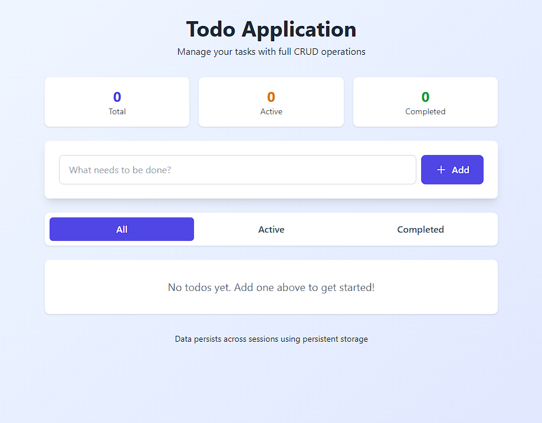
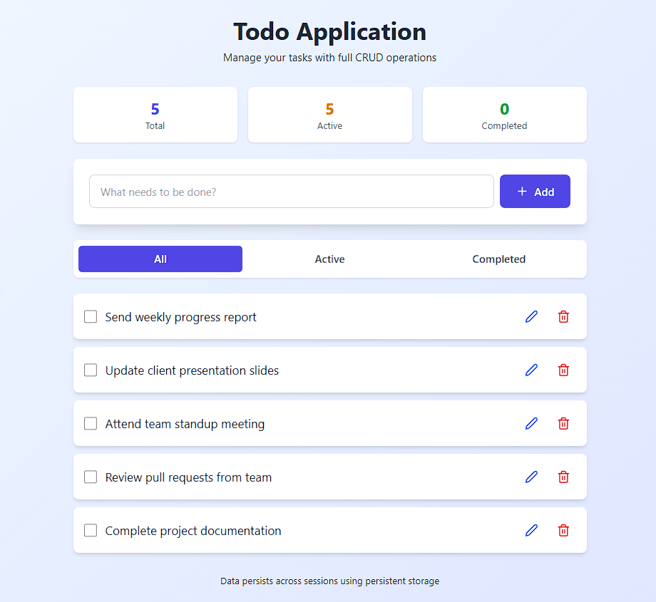
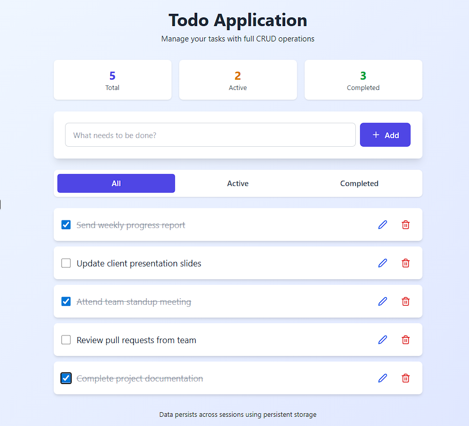
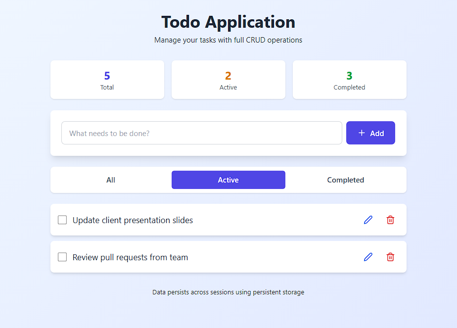

# Todo Fullstack (React + Express + MongoDB)

This bundle contains two folders:
- client : React (Vite) frontend
- server : Express + Mongoose backend

## 📸 Project Output

### 🖼️ Output 1

### 🖼️ Output 2

### 🖼️ Output 3

### 🖼️ Output 4

### 🖼️ Output 5

